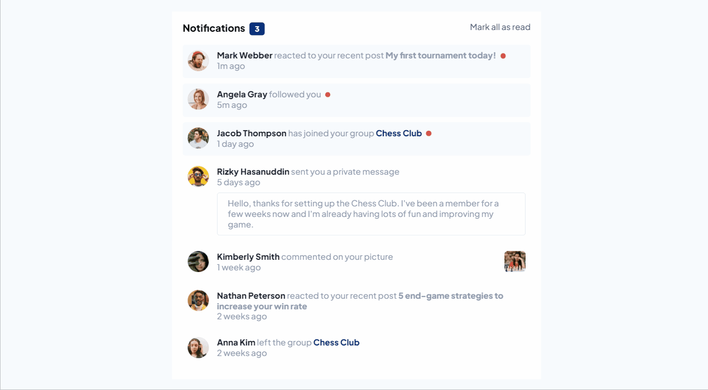
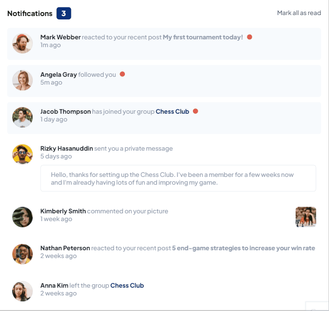
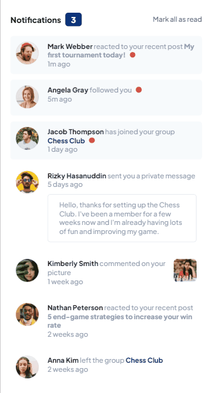

# Notifications-page

Este desafio foi retirado do site Frontend Mentor.   [Clique aqui](https://www.frontendmentor.io/challenges/notifications-page-DqK5QAmKbC) para conferi-lo.

## Do que se trata esse desafio?
Trata-se de uma página simulando notificações de uma rede social.

## Quais validações devem ser feitas?
- Ao clicar sobre uma notificação não lida, ela mudará seu estado para "lido" mudando sua caracteristica.
- No topo da página, o contador de mensagens não lidas irá mudar conforme as notificações forem sendo clicadas.
- Também há um botão que ao ser clicado, todas as mensagens serão marcadas como "lidas".

## Habilidades desenvolvidas:
- Uso de tags semânticas na construção do HTML.
- Uso de flexbox para ajustes dos elementos na tela.
- Uso e manipulação dos elementos no JavaScript.
- Uso de funções e métodos para o correto funcionamento das notificações lidas e não lidas.
- Uso de mediaqueries para responsividade.

## Linguagens Utilizadas:
- HTML 

- CSS  

- JAVASCRIPT  
          

## Veja como ficou:

### Desktop:
  

### Tablet:  
 
 
### Mobile:
 

Para ver o projeto pronto, [clique aqui!](https://jessica-os.github.io/Notifications-page/)
